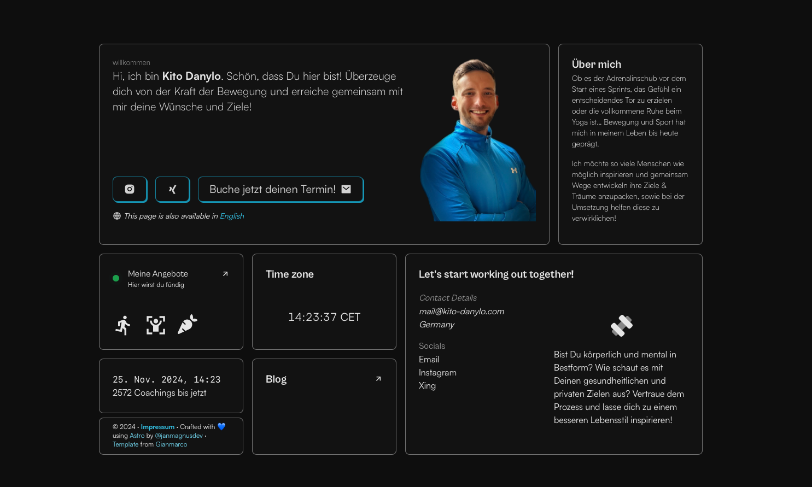

# ⚡️Kito Danylo Website



A personal portfolio website made using `Astro`.

## Tech Stack

- [Astro](https://astro.build)
- [SolidJS](https://www.solidjs.com)
- [unocss](https://unocss.dev/)
- [motion](https://motion.dev/)
- [d3](https://d3js.org/)

# Steps ▶️

```bash
# Clone this repository
$ git clone https://github.com/Ladvace/astro-bento-portfolio
```

```bash
# Go into the repository
$ cd astro-bento-portfolio
```

```bash
# Install dependencies
$ pnpm install
or
$ npm install
```

```bash
# Start the project in development
$ pnpm run dev
or
$ npm run dev
```

## Authors ❤️

- Jan-Magnus Monenschein - https://bio.link/janmagnusdev
- Original Template: Gianmarco - https://github.com/Ladvace
